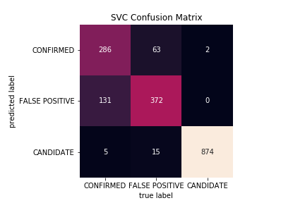
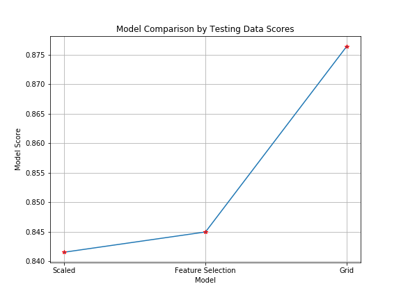
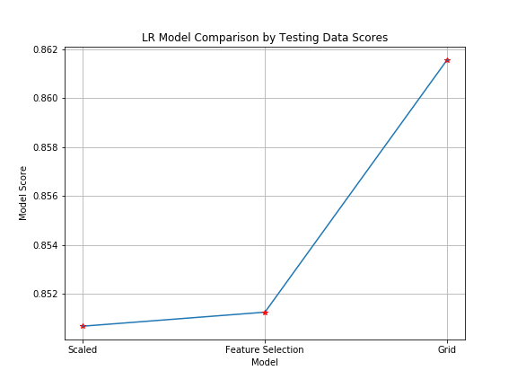

# Exoplanet Exploration

## Background

This script is for the following scenario: Over a period of nine years in deep space, the NASA Kepler space telescope has been out on a planet-hunting mission to discover hidden planets outside of our solar system. To help process this data, this script creates machine learning models capable of classifying candidate exoplanets from the raw dataset.


## Prequisites

The script requires imports of the following:

Basic Imports:

```
import pandas as pd
import numpy as np
import matplotlib.pyplot as plt
import seaborn as sns
```

ML imports:
```
from sklearn.model_selection import train_test_split
from sklearn.preprocessing import MinMaxScaler
from sklearn.linear_model import LogisticRegression
from sklearn.metrics import classification_report
from sklearn.feature_selection import RFE
from sklearn.model_selection import GridSearchCV
from sklearn.metrics import confusion_matrix
import joblib
```


## Steps

### 1. Preprocess the Data

- Preprocess the dataset prior to fitting the model
- Perform feature selection and remove unnecessary features
- Use `MinMaxScaler` to scale the numerical data

### 2. Tune Model Parameters

- Use `GridSearch` to tune model parameters.

- Tune and compare at least two different classifiers.


## Analysis

### Comparison of Models

#### SVC (Support Vector Classification)

##### Classification Reports

###### Scaled (MinMaxScaler)

|                | Precision | Recall | f1-score | support |
| -------------- | --------- | ------ | -------- | ------- |
| CANDIDATE      | 0.74      | 0.59   | 0.66     | 422     |
| CONFIRMED      | 0.67      | 0.77   | 0.72     | 450     |
| FALSE POSITIVE | 0.98      | 1.00   | 0.99     | 876     |
|                |           |        |          |         |
| micro avg      | 0.84      | 0.84   | 0.85     | 1748    |
| macro avg      | 0.80      | 0.79   | 0.79     | 1748    |
| weighted avg   | 0.84      | 0.84   | 0.84     | 1748    |

---------------------------------------------------------

###### Feature Selection (RFE)

|                | Precision | Recall | f1-score | support |
| -------------- | --------- | ------ | -------- | ------- |
| CANDIDATE      | 0.75      | 0.59   | 0.66     | 422     |
| CONFIRMED      | 0.68      | 0.78   | 0.73     | 450     |
| FALSE POSITIVE | 0.98      | 1.00   | 0.99     | 876     |
|                |           |        |          |         |
| micro avg      | 0.84      | 0.84   | 0.84     | 1748    |
| macro avg      | 0.80      | 0.79   | 0.79     | 1748    |
| weighted avg   | 0.85      | 0.84   | 0.84     | 1748    |

---------------------------------------------------------

###### Grid (Hyperparameter Tuning)

|                | Precision | Recall | f1-score | support |
| -------------- | --------- | ------ | -------- | ------- |
| CANDIDATE      | 0.81      | 0.68   | 0.74     | 422     |
| CONFIRMED      | 0.74      | 0.83   | 0.78     | 450     |
| FALSE POSITIVE | 0.98      | 1.00   | 0.99     | 876     |
|                |           |        |          |         |
| micro avg      | 0.88      | 0.88   | 0.88     | 1748    |
| macro avg      | 0.84      | 0.83   | 0.84     | 1748    |
| weighted avg   | 0.88      | 0.88   | 0.88     | 1748    |

By comparing the SVC model's f1-score, it is clear that the SVC model preforms best after scaling the X values, filtering the X values for the top 25 important features, and hypertuning the parameters using grid search. The feature selection model only increases the f1-score by 0.01 for the Confirmed category compared to the scaled model, and the f1-score is constant for the Candidate and False Positive categories compared to the scaled model. However, the f1-score for the grid model increases by 0.08 for the Candidate category, 0.05 for the Confirmed category, and stays constant for the False Positive category. For all three models, the f1-score is 0.99 for the False Positive category, meaning the models have near perfect precision and recall for the False Positive category. The grid model preforms best because the f1-scores are closer to 1 for all categories, and the precision and recall scores are greater for the Candidate and Confirmed categories than the other two models.





By comparing the SVC model's testing score, it is clear that the SVC model preforms best after scaling the X values, filtering the X values for the top 25 important features, and hypertuning the parameters using grid search. The model's testing score increases slightly (only 0.41%) when filtering the X values for the top 25 important features as opposed to only using the scaled X values. However, the grid model's testing score increases 4.15% compared to fitting the model only using scaled X values, and increases 3.72% compared to fitting the money using scaled X values and choosing the top 25 important features.


#### Logistic Regression

##### Classification Reports

###### Scaled (MinMaxScaler)

|                | Precision | Recall | f1-score | support |
| -------------- | --------- | ------ | -------- | ------- |
| CANDIDATE      | 0.76      | 0.61   | 0.68     | 422     |
| CONFIRMED      | 0.69      | 0.79   | 0.74     | 450     |
| FALSE POSITIVE | 0.98      | 0.79   | 0.99     | 876     |
|                |           |        |          |         |
| micro avg      | 0.85      | 0.85   | 0.85     | 1748    |
| macro avg      | 0.81      | 0.80   | 0.80     | 1748    |
| weighted avg   | 0.85      | 0.85   | 0.85     | 1748    |

---------------------------------------------------------
###### Feature Selection (RFE)

|                | Precision | Recall | f1-score | support |
| -------------- | --------- | ------ | -------- | ------- |
| CANDIDATE      | 0.76      | 0.61   | 0.68     | 422     |
| CONFIRMED      | 0.69      | 0.79   | 0.74     | 450     |
| FALSE POSITIVE | 0.98      | 1.00   | 0.99     | 876     |
|                |           |        |          |         |
| micro avg      | 0.85      | 0.85   | 0.85     | 1748    |
| macro avg      | 0.81      | 0.80   | 0.80     | 1748    |
| weighted avg   | 0.85      | 0.85   | 0.85     | 1748    |

---------------------------------------------------------
###### Grid (Hyperparameter Tuning)

|                | Precision | Recall | f1-score | support |
| -------------- | --------- | ------ | -------- | ------- |
| CANDIDATE      | 0.84      | 0.66   | 0.74     | 422     |
| CONFIRMED      | 0.74      | 0.85   | 0.79     | 450     |
| FALSE POSITIVE | 0.98      | 1.00   | 0.99     | 876     |
|                |           |        |          |         |
| micro avg      | 0.88      | 0.88   | 0.88     | 1748    |
| macro avg      | 0.85      | 0.84   | 0.84     | 1748    |
| weighted avg   | 0.88      | 0.88   | 0.88     | 1748    |

By comparing the SVC model's f1-score, it is clear that the SVC model preforms best after scaling the X values, filtering the X values for the top 25 important features, and hypertuning the parameters using grid search. Thef1-score for the feature selection model stays constant for all categories compared to the scaled model. However, the f1-score for the grid model increases by 0.06 for the Candidate category, 0.05 for the Confirmed category, and stays constant for the False Positive category. For all three models, the f1-score is 0.99 for the False Positive category, meaning the models have near perfect precision and recall for the False Positive category. The grid model preforms best because the f1-scores are closer to 1 for all categories, and the precision and recall scores are greater for the Candidate and Confirmed categories than the other two models.




By comparing the LR model's testing score, it is clear that the LR model preforms best after scaling the X values, filtering the X values for the top 25 important features, and hypertuning the parameters using grid search. The model's testing score increases very slightly (only 0.07%) when filtering the X values for the top 25 important features as opposed to only using the scaled X values. However, the grid model's testing score increases 1.28% compared to fitting the model only using scaled X values, and increases 1.21% compared to fitting the money using scaled X values and choosing the top 25 important features.


Thus, the best model is the SVC Model. Below shows a comparison of the f1-scores for both models:

| f1-Scores      | SVC  | LR   |
| -------------- | ---- | ---- |
| CANDIDATE      | 0.74 | 0.74 |
| CONFIRMED      | 0.78 | 0.79 |
| FALSE POSITIVE | 0.99 | 0.99 |

The testing score for the SVC model is 87.6% and the testing score for the LR model is 86.2%. Thus, the SVC model is the best model out of the two models, as it has a higher mean accuracy score. The SVC model is good for predicting new expoplanets; however, another model may be able to predict closer to 90%. Perhaps a Neural Network can be employed to achieve a higher score. 
